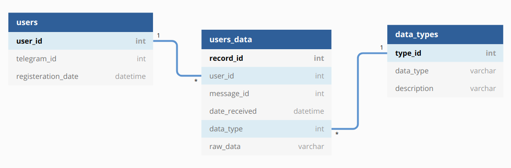

# SaveLeisure :robot:

Telegram bot that will save interesting information that you send to it and which you want to read / watch later. Such information as a blogpost, film, book.

## Scheme of used Database [[link]](https://dbdiagram.io/d/5fa924cf3a78976d7b7b1930)

> Bot :robot: is available by the following [link](http://t.me/SaveLeisureBot)
